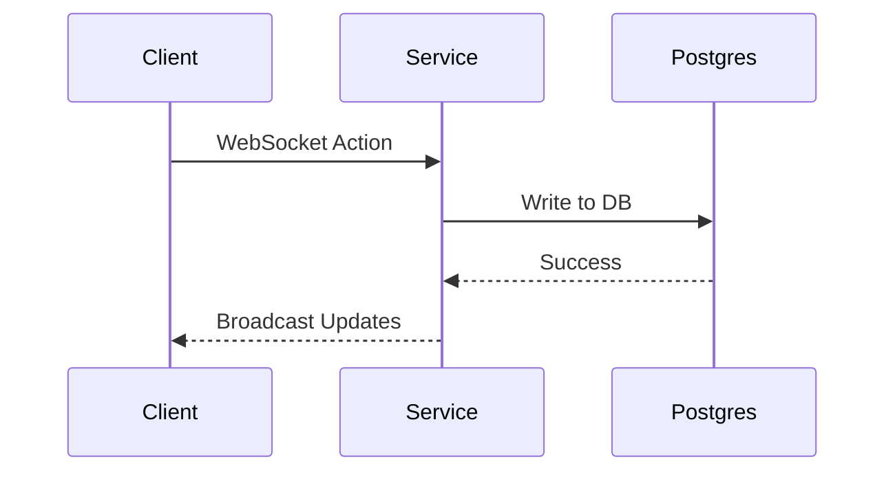
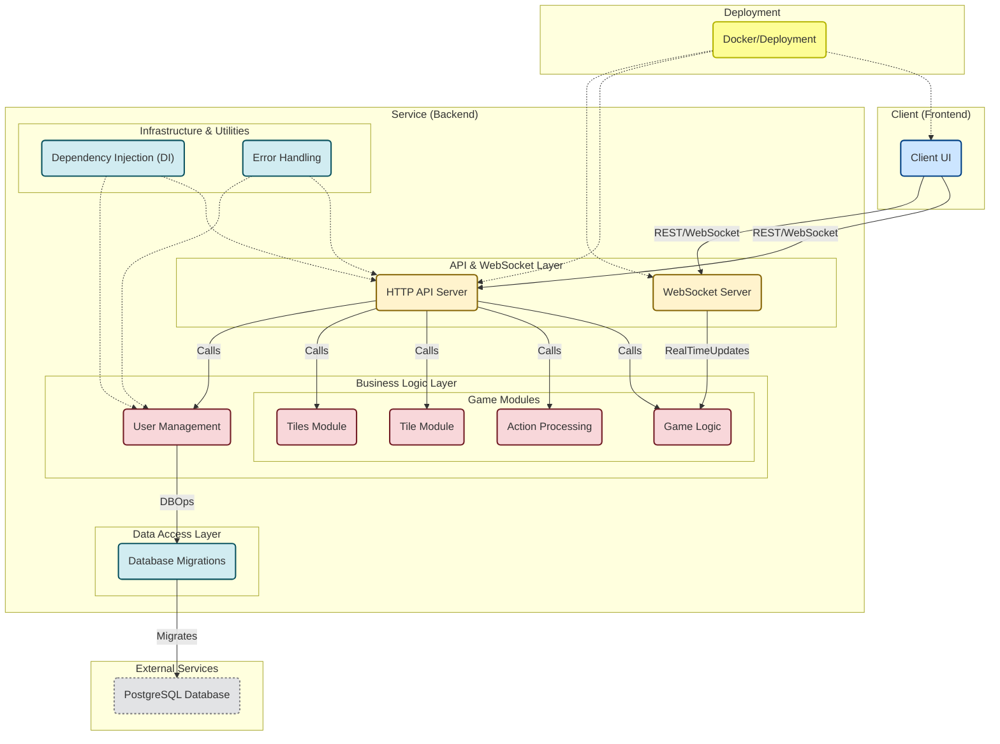

* Platform and framework agnostic

```mermaid
sequenceDiagram
    Client->>Service: WebSocket Action
    Service->>Postgres: Write to DB
    Postgres-->>Service: Success
    Service-->>Client: Broadcast Updates
```

```mermaid
graph TD
    subgraph "Client (Frontend)"
        ClientFrontend("Client UI"):::frontend
    end

    subgraph "Service (Backend)"
        subgraph "API & WebSocket Layer"
            HTTPAPIServer("HTTP API Server"):::api
            WSS("WebSocket Server"):::api
        end
        subgraph "Business Logic Layer"
            subgraph "Game Modules"
                GameLogic("Game Logic"):::business
                ActionProcess("Action Processing"):::business
                TileModule("Tile Module"):::business
                TilesModule("Tiles Module"):::business
            end
            UserMgmt("User Management"):::business
        end
        subgraph "Data Access Layer"
            DBMigrations("Database Migrations"):::infra
        end
        subgraph "Infrastructure & Utilities"
            DI("Dependency Injection (DI)"):::infra
            ErrorHandling("Error Handling"):::infra
        end
    end

    subgraph "External Services"
        PostgresDB("PostgreSQL Database"):::db
    end

    subgraph "Deployment"
        Docker("Docker/Deployment"):::deploy
    end

    ClientFrontend -->|"REST/WebSocket"| HTTPAPIServer
    ClientFrontend -->|"REST/WebSocket"| WSS
    HTTPAPIServer -->|"Calls"| GameLogic
    HTTPAPIServer -->|"Calls"| ActionProcess
    HTTPAPIServer -->|"Calls"| TileModule
    HTTPAPIServer -->|"Calls"| TilesModule
    HTTPAPIServer -->|"Calls"| UserMgmt
    WSS -->|"RealTimeUpdates"| GameLogic
    UserMgmt -->|"DBOps"| DBMigrations
    DBMigrations -->|"Migrates"| PostgresDB
    DI -.-> HTTPAPIServer
    ErrorHandling -.-> HTTPAPIServer
    DI -.-> UserMgmt
    ErrorHandling -.-> UserMgmt
    Docker -.-> ClientFrontend
    Docker -.-> HTTPAPIServer
    Docker -.-> WSS

    click ClientFrontend "https://github.com/mrbogdan/monopoly/blob/main/client/src/map-playground.html"
    click GameLogic "https://github.com/mrbogdan/monopoly/tree/main/service/src/game"
    click ActionProcess "https://github.com/mrbogdan/monopoly/tree/main/service/src/action"
    click TileModule "https://github.com/mrbogdan/monopoly/tree/main/service/src/tile"
    click TilesModule "https://github.com/mrbogdan/monopoly/tree/main/service/src/tiles"
    click UserMgmt "https://github.com/mrbogdan/monopoly/tree/main/service/src/user"
    click HTTPAPIServer "https://github.com/mrbogdan/monopoly/tree/main/service/src/http"
    click WSS "https://github.com/mrbogdan/monopoly/tree/main/service/src/wss"
    click DI "https://github.com/mrbogdan/monopoly/tree/main/service/src/di"
    click ErrorHandling "https://github.com/mrbogdan/monopoly/tree/main/service/src/errors"
    click DBMigrations "https://github.com/mrbogdan/monopoly/blob/main/service/src/migrations/MNP-22/create-user-table.sql"
    click Docker "https://github.com/mrbogdan/monopoly/blob/main/docker-compose.yml"

    classDef frontend fill:#cce5ff,stroke:#004085,stroke-width:2px;
    classDef api fill:#fff3cd,stroke:#856404,stroke-width:2px;
    classDef business fill:#f8d7da,stroke:#721c24,stroke-width:2px;
    classDef infra fill:#d1ecf1,stroke:#0c5460,stroke-width:2px;
    classDef db fill:#e2e3e5,stroke:#818182,stroke-dasharray:3,3,stroke-width:2px;
    classDef deploy fill:#fdfd96,stroke:#b4b400,stroke-width:2px;
```
